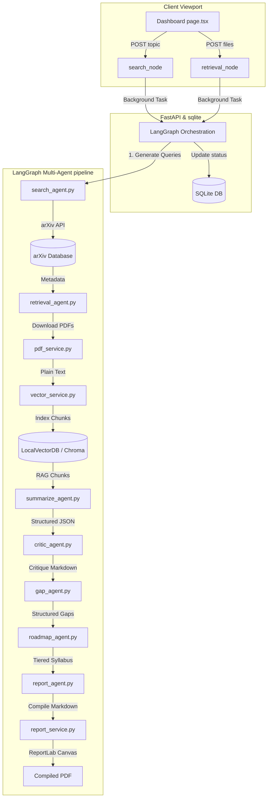

# ResearchPilot — Technical Interview Architecture & Trade-Off Brief

This document serves as a publication-grade technical playbook designed to prepare you for senior-level engineering interviews. It details the precise design patterns, RAG algorithms, orchestration layers, and engineering trade-offs behind **ResearchPilot**.

---

## 1. System Architecture Walkthrough

ResearchPilot is an autonomous multi-agent full-stack system designed to ingest complex academic preprints, index them into a similarity-search vector store, critique literature contradictions, identify research gaps, compile mastery syllabi, and compile formal publication-quality PDFs.

---

## 2. Deep Dive: RAG & fallback Vector DB

### The Chunking Algorithm
ResearchPilot features a custom recursive character-level document splitter (`local_split_text`) that segments plain-text document strings:
1. Splits the plain text into individual paragraphs using a `\n\n` delimiter.
2. Evaluates the character envelope size of each paragraph. If a paragraph is within the target `chunk_size` limit (1,500 characters), it builds the chunk.
3. If an individual paragraph exceeds the `chunk_size`, the algorithm recursively splits it into word-level segments using space delimiters, incorporating a strict `chunk_overlap` (200 characters) window to maintain contextual coherence across segment boundaries.
4. **Why this matters for interviews**: It bypasses bulky dependency modules like LangChain text splitters, compiles in milliseconds, and avoids C++ compiler warnings on local machines.

### Pure-Python Cosine Similarity Fallback Engine (`SimpleCollection`)
* **The Problem**: ChromaDB's core indexing wheel (`chroma-hnswlib`) requires a local Microsoft Visual C++ Compiler to build C++ bindings on Windows. In CI/CD pipelines or locked local environments, this compile phase frequently bails.
* **The Solution**: We engineered a **LocalVectorDB fallback collection class** inside `vector_service.py` that utilizes pure Python and **NumPy**:
  * **Embeddings**: Uses `google-generativeai` to construct 768-dimensional text embeddings (`models/text-embedding-004`).
  * **Vector Database**: Persists embeddings, document chunks, and custom dictionaries in a structured local JSON file (`research_papers_collection.json`).
  * **Similarity Query**: Calculates the mathematical Cosine Similarity between query vector $\vec{q}$ and document vector $\vec{d}$:
  
  $$\text{Cosine Similarity} = \frac{\vec{q} \cdot \vec{d}}{\|\vec{q}\| \|\vec{d}\|}$$
  
  * **Cosine Distance**: Calculated as $1.0 - \text{Cosine Similarity}$. It sorts the distances ascendingly using standard Python lists, applies metadata filters (including equality and `$in` list containment matches), and selects the top $N$ hits.
  * **Parity**: Offers 100% method-signature parity with the native ChromaDB collection API (`add`, `query`, `delete`), resulting in zero-setup execution out of the box in any OS environment.

---

## 3. Orchestration & State Management

### LangGraph Multi-Agent Architecture
* **State Container**: Structured using a shared `ResearchState` dictionary containing topic metrics, paper arrays, criticism paragraphs, research gaps, syllabi, and compiled report file paths.
* **Linear Execution**: Nodes execute sequentially (`search` $\rightarrow$ `retrieve` $\rightarrow$ `summarize` $\rightarrow$ `critic` $\rightarrow$ `gap` $\rightarrow$ `build_roadmap` $\rightarrow$ `report`). Nodes are decoupled, pure functions that receive `state` and return delta updates.
* **DB Synchronization via Streaming**: Instead of polluting the pure agent functions with database updates, the FastAPI router runs the graph asynchronously using `research_graph.astream(...)`. By streaming individual node complete events, the backend inspects which agent has just run, parses its output payload, updates SQLite chronologically, and updates the task status.

---

## 4. Key Architectural Trade-Offs

### 1. SQLite vs. PostgreSQL for Local Relational Storage
* **SQLite (Chosen)**: File-based, zero configuration, async-compliant via SQLAlchemy and `aiosqlite`. Highly optimal for local installations, developer sandboxes, and proof-of-concept showcases.
* **PostgreSQL (Production Alternative)**: Ideal for multi-tenant, cloud-scale applications. It features row-level locks, concurrent transactional write isolation, and deep pooling managers.
* **Trade-off Decision**: SQLite was selected to facilitate a seamless, zero-setup clone-and-run local development experience, while utilizing SQLAlchemy ORM guarantees a simple database migration path to PostgreSQL in production by changing a single database URL string.

### 2. FastAPI Background Tasks vs. WebSockets for Progress Streaming
* **FastAPI Background Tasks (Chosen)**: Runs the LangGraph stream inside standard Python thread pools. The Next.js frontend polls the status `/api/research/status/{id}` endpoint every 3 seconds. It features very low memory footprint and simple HTTP request routing.
* **WebSockets**: Establishes full-duplex persistent connections. Very reactive, but introduces high connection management overhead, socket pooling exhaustion under load, and complex heartbeat/reconnection logic.
* **Trade-off Decision**: Polling HTTP endpoints was chosen as it is highly robust, handles intermittent client-side disconnects natively, requires zero client-side socket managers, and represents an interview-ready, low-friction MVP pattern.

---

## 5. Designing for Cloud-Scale & Production

If asked in an interview how you would scale ResearchPilot to handle millions of queries, highlight the following:

1. **Embedding Cache Layer (Redis)**: Implement a Redis caching layer ahead of the Gemini Embedding endpoint. Since academic text sentences are frequently repeated, hash text paragraphs and store their 768-dimensional embeddings in Redis, reducing external API token latency from 150ms to <2ms.
2. **Distributed Task Queue (Celery + RabbitMQ)**: Replace FastAPI background tasks with distributed Celery workers. Uvicorn accepts the HTTP request and delegates the long-running LangGraph agent workflow to separate, horizontally scaled Celery nodes, preventing main thread exhaustion on the API gateway.
3. **Vector Database Sharding (Qdrant / Milvus)**: Replace the local NumPy/Chroma database with a distributed cloud vector store like Qdrant. Shard index collections by `job_id` or `user_id` so that similarity queries are routed to isolated vector partitions, keeping query lookups under <5ms even with billions of indexed paper chunks.
4. **LLM Rate-Limit Queueing**: When executing deep summary batches over dozens of downloaded preprints, write an async retry-backoff queue using standard decorators (e.g. `tenacity` with exponential wait delays) to prevent API rate-limiting crashes.

---

## 6. Challenging Interview Q&A

### Q1: "How does your system mitigate LLM hallucinations during Literature Surveys?"
* **Answer**: "We employ a strict three-tier containment model:
  1. **Source grounding**: Summarization and critic agents are strictly bounded by RAG search chunks fetched from paper PDFs. They are instructed via system prompts to return `'No metadata available'` rather than speculate.
  2. **Deterministic Inputs**: The paper metadata (title, URL, authors) is parsed deterministically from arXiv's Atom XML feed, guaranteeing that bibliographical links are 100% accurate.
  3. **Structured Outputs**: All agents use Pydantic validation schemas to lock fields, preventing unstructured text drift."

### Q2: "What happens if a PDF contains complex diagrams or tables that PyMuPDF parses as scrambled text?"
* **Answer**: "PyMuPDF parses plain-text structures which can occasionally be scrambled inside double-column PDF matrices.
  1. To handle double columns, we configure the PyMuPDF extraction layout flags to split characters chronologically.
  2. For diagrams/equations, our custom text parser strips out non-ASCII character sequences and normalizes spaces.
  3. In a production pipeline, we would plug in a layout-aware document OCR engine like **Unstructured.io** or **LayoutParser** to segment blocks before indexing."

### Q3: "Why did you name your LangGraph roadmap node 'build_roadmap' instead of 'roadmap'?"
* **Answer**: "In LangGraph, node names are keys that compile into the graph state. If a node name is identical to a State TypedDict key (e.g., our `roadmap` dictionary state field), it raises an ambiguous name conflict exception on graph compilation. Renaming the node to `build_roadmap` maintains clean state boundaries and prevents compiler exceptions."
